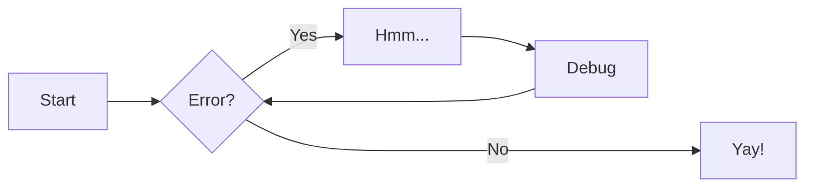

# Quickstart

Lorem ipsum dolor sit amet, consectetur adipiscing elit. Morbi cursus in risus
quis mattis. Sed feugiat efficitur sagittis. Cras in posuere nisl, a vestibulum
odio. Quisque eget arcu at ipsum porttitor suscipit vitae ut metus. Praesent
sit amet libero nec risus fringilla faucibus sed ac lacus. Duis lobortis
lacinia neque. Pellentesque consequat vehicula diam, eu consequat mi vehicula
eget. Nam vulputate molestie diam vitae dictum.

Donec mattis egestas ante, pulvinar dignissim diam ultrices non. Fusce gravida
augue enim, ornare dictum sapien cursus sed. Donec posuere augue dictum nibh
mattis, quis elementum dolor faucibus. Duis efficitur vestibulum arcu, et
pharetra mi mattis sit amet. Aliquam euismod feugiat bibendum. Sed pharetra
neque mauris, eu ultricies metus luctus a. Suspendisse potenti. Ut ullamcorper
ipsum a risus sagittis, ac mattis velit dignissim. In euismod sit amet lorem
sit amet vehicula. Nulla quam tortor, varius vitae pretium ac, volutpat id
lectus. Aliquam a magna quis sapien finibus luctus.

## Images and navigation

***

***
| Some info  | [**Phocka Wiki**](https://en.wikipedia.org/wiki/Phoca)  | [Changelog](./about/changelog.md)  |
|:---:|:---:|:---:|


## Formatting

`highlight`

*italic*

**bold**

- `highlight`

- **bold**

- ***bold and italic***

See more information [CLICK ME !!!!](https://www.markdownguide.org/basic-syntax/)


## Blockquotes

> Lorem ipsum dolor sit amet, consectetur adipiscing elit. Morbi cursus in
> risus quis mattis. Sed feugiat efficitur sagittis. Cras in posuere nisl, a
> vestibulum odio. Quisque eget arcu at ipsum porttitor suscipit vitae ut
> metus. Praesent

## Math via KaTeX

***

Let's Consider the following problem of classification $x\in\mathbb{X}^{p}\longmapsto y\in\left\{ 1,2,\ldots,M\right\}$.

Here, $x=\left(x_{1},x_{2},\ldots,x_{p}\right)$ is a vector of descriptors (or features) : $\forall i\in\left\{ 1,2,\ldots,p\right\} ,x_{i}\in\mathbb{X}$,
with $\mathbb{X}=\left\{ 1,2,\ldots,K\right\}$ (or $\mathbb{X}=\mathbb{R}$).

Goal : Learning $p\left(y|x\right)$

A very naive method will trigger off a combinatorial explosion : $\theta\in\mathbb{R}^{K^{p}}$.

Bayes formula gets us : 

$$
p\left(y|x\right)=\frac{p\left(x|y\right)p\left(y\right)}{p\left(x\right)}
$$


The Naive Bayes method consists in assuming that the features $x_{i}$ are all conditionally independent from the class, hence :

$$
p\left(x|y\right)=\prod_{i=1}^{p}p\left(x_{i}|y\right)
$$

Then, the Bayes formula gives us:

$$
p\left(y|x\right)=\frac{p\left(y\right) \prod_{i=1}^{p}p\left(x_{i}|y\right)}{p\left(x\right)}=\frac{p\left(y\right)\prod_{i=1}^{p}p\left(x_{i}|y\right)}{\sum_{y'} p\left(y'\right)\prod_{i=1}^{p}p\left(x_{i}|y'\right)}
$$


We consider the case where the features take discrete values. Consequently the
new graphical model contains only discrete random variables. Then, we can write
a discrete model as an exponential family. Indeed we can write:

$$
\log p\left ( x_{i}=k| y=k' \right )=\delta \left( x_{i}=k , \, y=k' \right) \theta_{ikk'}
$$

and

$$
\log p\left ( y=k' \right )=\delta \left( y=k' \right) \theta_{k'}
$$

We can see that the dummy functions $\delta(x_{i}=k,y=k')$ and $\delta(y=k')$
are the **sufficient statistics** of the joint distribution model for $y$
and the variables $x_i$, where $\theta_{ikk'}$ and $\theta_{k'}$ are
\emph{canonical parameters}.
Thus , we can write:

$$
\log p(y, x_1, \ldots, x_p)=\sum_{i,k,k'} \delta(x_i=k,y=k')\theta_{ikk'}+ \sum_{k'} \delta(y=k') \theta_{k'}-A((\theta_{ikk'})_{i,k,k'},(\theta_{k'})_{k'})
$$

Where $A((\theta_{ikk'})_{i,k,k'},(\theta_{k'})_{k'})$ is the log-partition function.\\

We have rewritten the joint distribution model of $(y, x_1,\ldots, x_p)$ as an
exponential family. Given that the maximum of likelihood estimator of an
exponential family, where the canonical parameters are not combined, is also
the maximum entropy estimator; as seen in a previous course and provided that
the statistical moments of the sufficient statistics equal their empirical
moments.\

Thus, if we introduce

$$
N_{ikk'}=\#\left\{ \left(x_{i},y\right)=\left(k,k'\right)\right\}
$$

$$
N=\sum_{i,k,k'}N_{ikk'},
$$

The maximum likelihood estimator must satisfy the moment constraints

$$
\widehat{p}\left(y=k'\right)=\frac{\sum_{i,k}N_{ikk'}}{N} \qquad \text{et} \qquad 
\widehat{p}\left(x_{i}=k|y=k'\right)=\frac{N_{ikk'}}{\sum_{k"}N_{ik"k'}},
$$

which define them completly.

Then, we can write the estimators of the canonical parameters as:

$$
\widehat{\theta}_{ikk'}=\log\widehat{p}\left(x_{i}=k|y=k'\right) \qquad \text{et} \qquad \widehat{\theta}_{k'}=\log\widehat{p}\left(y=k'\right).
$$

However, our goal is to obtain a classification model, that is to say, a model of only the conditional probability law. From the approximated generative model and applying the Bayes rule we can get:

$$
\log \widehat{p}\left(y=k'|x\right)=\sum_{i=1}^{p}\log \widehat{p}\left(x_{i}|y=k'\right)+\log \widehat{p}\left(y=k'\right)-\log\sum_{k'}\left(\widehat{p}\left(y=k'\right)\prod_{i=1}^{p}\widehat{p}\left(x_{i}|y=k'\right)\right)
$$

We can re write the conditional model as an exponential family
$$
\log p\left(y|x\right) = \sum_{i,k,k'} \delta(x_i=k,y=k')\theta_{ikk'}+ \sum_{k'} \delta(y=k') \theta_{k'}-\log p(x)
$$

Its sufficient statistics and canonical parameters are equal to those of the
generative model, but seen as functions of the random variable $y$, given that
$x$ is fixed (we could write $\phi_{x,i,k,k'}(y)=\delta(x_i=k,y=k')$). As for
the log-partition function, it is now equal to $\log p(x)$.\\

Warning: $\widehat{\theta}_{ikk'}$ is the maximum likelihood estimator in the
generative model which, usually, is not equal to the maximum likelihood
estimator in the conditional model.


The homomorphism $f$ is injective if and only if its kernel is only the
singleton set $e_G$, because otherwise $\exists a,b\in G$ with $a\neq b$ such
that $f(a)=f(b)$.

***

## Other math formatting

$$
\displaystyle P(A\vert B)={\frac {P(B\vert A)P(A)}{P(B)}}
$$

$$
E(\mathbf{v}, \mathbf{h}) = -\sum_{i,j}w_{ij}v_i h_j - \sum_i b_i v_i - \sum_j c_j h_j
$$

\[3 < 4\]

\begin{align}
    p(v_i=1|\mathbf{h}) & = \sigma\left(\sum_j w_{ij}h_j + b_i\right) \\
    p(h_j=1|\mathbf{v}) & = \sigma\left(\sum_i w_{ij}v_i + c_j\right)
\end{align}

## Tooltips

[Hover me](https://google.com "Take me to Google!")

## Tables


|        Name         |                                   When                                    |     Arguments (max. 4)      |
|:--------------------|:--------------------------------------------------------------------------|:----------------------------|
|       `quit`        |                              on program quit                              |        `%quit_mode%`        |
|      `reboot`       |                 on system reboot (also calls quit first)                  |                             |
|     `shutdown`      |                on system shutdown (also calls quit first)                 |                             |
|  `config-changed`   |                 on the change of any configuration option                 |                             |
| `controls-changed`  |        on change of the control settings (also calls config first)        |                             |
| `settings-changed`  | on change of the regular (non-control) settings (also calls config first) |                             |
|   `theme-changed`   |          on change of theme (also calls settings-changed after)           | `%new_theme%` `%old_theme%` |
|    `game-start`     |                          before starting a game                           |  `%rom_path%` `%rom_name%` `%game_name%` |
|     `game-end`      |                          after finishing a game                           |                             |

## Codeblocks

### Codeblocks with line numbers

``` py linenums="1"
def bubble_sort(items):
    for i in range(len(items)):
        for j in range(len(items) - 1 - i):
            if items[j] > items[j + 1]:
                items[j], items[j + 1] = items[j + 1], items[j]
```

### Codeblocks with title

``` py title="bubble_sort.py"
def bubble_sort(items):
    for i in range(len(items)):
        for j in range(len(items) - 1 - i):
            if items[j] > items[j + 1]:
                items[j], items[j + 1] = items[j + 1], items[j]
```

### Highlighting lines

``` py hl_lines="2 3"
def bubble_sort(items):
    for i in range(len(items)):
        for j in range(len(items) - 1 - i):
            if items[j] > items[j + 1]:
                items[j], items[j + 1] = items[j + 1], items[j]
```

## Icons and Emojs

:smile: 

:fontawesome-regular-face-laugh-wink:

:fontawesome-brands-twitter:{ .twitter }

:octicons-heart-fill-24:{ .heart }

## Admonitions (needs extension)

### Inline

!!! info inline end "Lorem ipsum"

    Lorem ipsum dolor sit amet, consectetur
    adipiscing elit. Nulla et euismod nulla.
    Curabitur feugiat, tortor non consequat
    finibus, justo purus auctor massa, nec
    semper lorem quam in massa.

Lorem ipsum dolor sit amet, consectetur adipiscing elit. Vestibulum eu
facilisis metus, non tincidunt tortor. Morbi faucibus ligula eget metus iaculis
dapibus. Mauris non vestibulum eros. Mauris pretium augue a mauris rhoncus
tincidunt. Morbi pharetra blandit scelerisque. Mauris vulputate efficitur
velit, at gravida ligula elementum ac. Vivamus at tempor elit. Nam eget laoreet
lectus, sed maximus est. Fusce et erat felis. Proin vel tristique lectus.

### Standalone

/// tip | Title of admonition
Lorem ipsum dolor sit amet, consectetur adipiscing elit. Vestibulum eu
facilisis metus, non tincidunt tortor. Morbi faucibus ligula eget metus iaculis
dapibus. Mauris non vestibulum eros. Mauris pretium augue a mauris rhoncus
///

## Flowcharts (needs extension)


## Lists

### Definition lists (needs extension)

`Lorem ipsum dolor sit amet`

:   Sed sagittis eleifend rutrum. Donec vitae suscipit est. Nullam tempus
    tellus non sem sollicitudin, quis rutrum leo facilisis.

`Cras arcu libero`

:   Aliquam metus eros, pretium sed nulla venenatis, faucibus auctor ex. Proin
    ut eros sed sapien ullamcorper consequat. Nunc ligula ante.

    Duis mollis est eget nibh volutpat, fermentum aliquet dui mollis.
    Nam vulputate tincidunt fringilla.
    Nullam dignissim ultrices urna non auctor.

### Unordered lists

***
- Nulla et rhoncus turpis. Mauris ultricies elementum leo. Duis efficitur
  accumsan nibh eu mattis. Vivamus tempus velit eros, porttitor placerat nibh
  lacinia sed. Aenean in finibus diam.

    * Duis mollis est eget nibh volutpat, fermentum aliquet dui mollis.
    * Nam vulputate tincidunt fringilla.
    * Nullam dignissim ultrices urna non auctor.
***

***
1. **sleep/wake** use no arguments.
   
   `systemSleepTime` is usually after `screenSaverTime` (both editable in the Screensaver Menu). A value of `0` disables sleep and the  screensaver respectively.

2. **%media%** is one of:

   * `randomvideo`: a video is played when screensaver is set to _Random Video_
   * `slideshow`: a picture is displayed when screensaver is set to _Slideshow_
***

## Footnotes

[^1]:
    Lorem ipsum dolor sit amet, consectetur adipiscing elit. Nulla et euismod
    nulla. Curabitur feugiat, tortor non consequat finibus, justo purus auctor
    massa, nec semper lorem quam in massa.

[^2]: Lorem ipsum dolor sit amet, consectetur adipiscing elit. Nulla et euismod 
